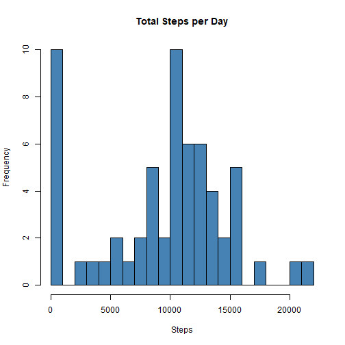
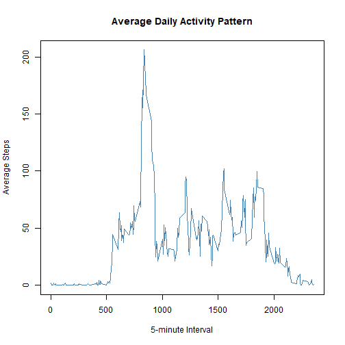
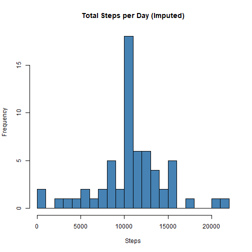
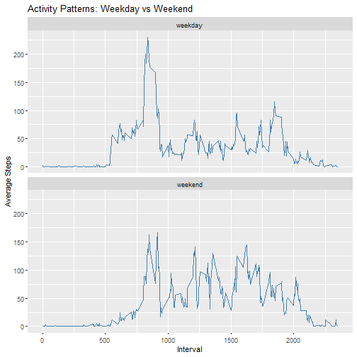

## Loading and Preprocessing the Data


``` r
activity <- read.csv("activity.csv")
activity$date <- as.Date(activity$date, "%Y-%m-%d")
```

## What is Mean Total Number of Steps Taken Per Day?


``` r
library(dplyr)
steps_per_day <- activity %>%
  group_by(date) %>%
  summarize(total_steps = sum(steps, na.rm = TRUE))

hist(steps_per_day$total_steps, main = "Total Steps per Day",
     xlab = "Steps", col = "steelblue", breaks = 20)
```



``` r
mean_steps <- mean(steps_per_day$total_steps)
median_steps <- median(steps_per_day$total_steps)
mean_steps
```

```
## [1] 9354.23
```

``` r
median_steps
```

```
## [1] 10395
```
The mean total number of steps taken per day is 9354.23 steps while the median is 10395 steps.

## What is the Average Daily Activity Pattern?


``` r
steps_per_interval <- activity %>%
  group_by(interval) %>%
  summarize(mean_steps = mean(steps, na.rm = TRUE))

plot(steps_per_interval$interval, steps_per_interval$mean_steps, type = "l",
     main = "Average Daily Activity Pattern", xlab = "5-minute Interval",
     ylab = "Average Steps", col = "steelblue")
```



``` r
max_interval <- steps_per_interval$interval[which.max(steps_per_interval$mean_steps)]
max_interval
```

```
## [1] 835
```
The 5-minute interval, on average across all the days in the dataset, which contains the maximum number of steps is the 835th interval.

## Imputing Missing Values


``` r
total_na <- sum(is.na(activity$steps))
total_na
```

```
## [1] 2304
```

``` r
# Replace NAs with mean for that interval
activity_filled <- activity
activity_filled$steps <- ifelse(is.na(activity_filled$steps),
                                ave(activity_filled$steps, activity_filled$interval, FUN = function(x) mean(x, na.rm = TRUE)),
                                activity_filled$steps)

steps_per_day_filled <- activity_filled %>%
  group_by(date) %>%
  summarize(total_steps = sum(steps))

hist(steps_per_day_filled$total_steps, main = "Total Steps per Day (Imputed)",
     xlab = "Steps", col = "steelblue", breaks = 20)
```



``` r
mean_steps_filled <- mean(steps_per_day_filled$total_steps)
median_steps_filled <- median(steps_per_day_filled$total_steps)
mean_steps_filled
```

```
## [1] 10766.19
```

``` r
median_steps_filled
```

```
## [1] 10766.19
```
The total number of missing values in the dataset (i.e. the total number of rows with 
NA) is 2304.

Impact of Imputing Missing Data

After imputing missing data, the mean total number of steps taken per day is 10766.19 and the median is 10766.19.

The mean and median values are slightly higher after imputing missing data because missing values were filled in using average values per interval.

## Are There Differences in Activity Patterns Between Weekdays and Weekends?

``` r
activity_filled$day_type <- ifelse(weekdays(activity_filled$date) %in% c("Saturday", "Sunday"),
                                   "weekend", "weekday")
activity_filled$day_type <- factor(activity_filled$day_type)

steps_by_daytype <- activity_filled %>%
  group_by(interval, day_type) %>%
  summarize(mean_steps = mean(steps))

library(ggplot2)
ggplot(steps_by_daytype, aes(x = interval, y = mean_steps)) +
  geom_line(color = "steelblue") +
  facet_wrap(~ day_type, nrow = 2) +
  labs(title = "Activity Patterns: Weekday vs Weekend",
       x = "Interval", y = "Average Steps")
```



